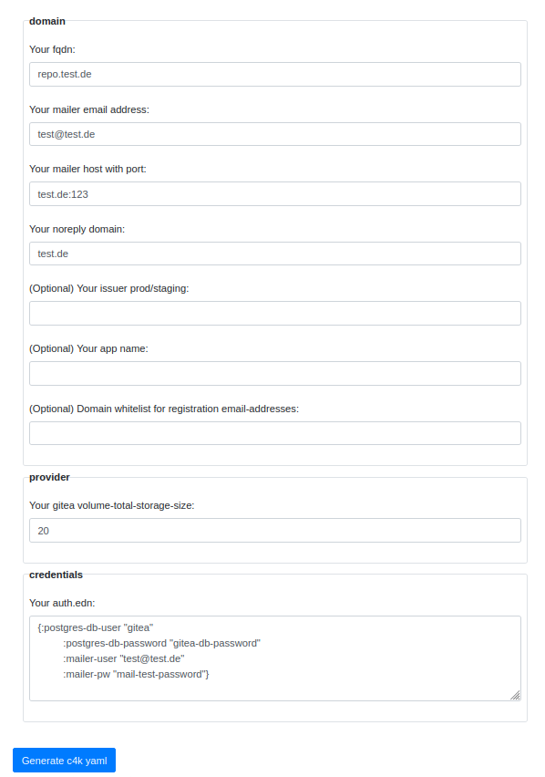

# convention 4 kubernetes: c4k-common
[](https://clojars.org/org.domaindrivenarchitecture/c4k-common-clj) [](https://clojars.org/org.domaindrivenarchitecture/c4k-common-cljs) [](https://gitlab.com/domaindrivenarchitecture/c4k-common/-/commits/master) 

[ chat over e-mail](mailto:buero@meissa-gmbh.de?subject=community-chat) | [ team@social.meissa-gmbh.de](https://social.meissa-gmbh.de/@team) | [Website & Blog](https://domaindrivenarchitecture.org)

## Rationale

There are many comparable solutions for creating c4k deployments like `helm` or `kustomize`. 
`kustomize` is great to manage your k8s manifests by splitting huge files into handy parts.
`helm` is great because of its large community.

Why do we need another one? Why do you continue the reading here?

We combine the simplicity of `kustomize` with the ability to do real programming like software developers would do.

Following the principle

    "Use programming language for programming" 

we clearly enjoy writing Kubernetes manifests with Clojure. In comparison to helms templating, things such as business logic, conventions, input validation, versions, dependencies and reuse are much easier and much more reliable to implement with c4k.

By the way, c4k means "convention for kubernetes".

### Features

c4k-common supports the following use cases:

- [convention 4 kubernetes: c4k-common](#convention-4-kubernetes-c4k-common)
  - [Rationale](#rationale)
    - [Features](#features)
      - [Target CLI and Web Frontend](#target-cli-and-web-frontend)
      - [Separate Configuration From Credentials](#separate-configuration-from-credentials)
      - [Input as EDN or Yaml](#input-as-edn-or-yaml)
      - [Inline k8s Resources for Versioning \& Dependencies](#inline-k8s-resources-for-versioning--dependencies)
      - [Work on Structured Data Instead of Flat Templating](#work-on-structured-data-instead-of-flat-templating)
      - [Validate Your Inputs](#validate-your-inputs)
      - [Namespaces](#namespaces)
      - [Ingress](#ingress)
      - [Postgres Database](#postgres-database)
      - [Monitoring With Grafana Cloud](#monitoring-with-grafana-cloud)
  - [Refactoring \& Module Overview](#refactoring--module-overview)
  - [Development \& Mirrors](#development--mirrors)
  - [License](#license)

#### Target CLI and Web Frontend

To create your own c4k module set up your cli analogous to the following:

```clojure
(defn -main [& cmd-args]
  (uberjar/main-common 
   "c4k-forgejo"              ;; name of your app
   core/config?               ;; schema for config validation
   core/auth?                 ;; schema for credential validation
   core/config-defaults       ;; want to set default values?
   core/k8s-objects           ;; the function generate the k8s manifest
   cmd-args                   ;; command line arguments given
   ))                 
```

The full example can be found here: https://repo.prod.meissa.de/meissa/c4k-forgejo/src/branch/main/src/main/clj/dda/c4k_forgejo/uberjar.clj

With c4k instead of using cli to generate manifests, you can also generate your manifests via web-application (using page local js without server interaction)

```html
<html>

<head>
  <link href="bootstrap.min.css" rel="stylesheet" type="text/css" />
</head>

<body>
  <div id="c4k-content"></div>
  <script src="js/main.js"></script>
</body>

</html>
```

[](https://domaindrivenarchitecture.org/pages/dda-provision/c4k-forgejo/)

See: https://repo.prod.meissa.de/meissa/c4k-forgejo/src/branch/main/public/index.html

and: https://repo.prod.meissa.de/meissa/c4k-forgejo/src/branch/main/src/main/cljs/dda/c4k_forgejo/browser.cljs

#### Separate Configuration From Credentials

We think it is a good idea to have credentials separated from configuration. All our functions, cli and frontend are following this principle. Thus, for executing separated config and authentication infos have to be provided.

The following command line yields the resulting k8s manifests in `k8s-manifest.yaml`:
```bash
java -jar c4k-common.jar config.edn auth.edn > k8s-manifest.yaml
```

Using the tool `jarwrapper` the command line can even be shortened to:
```bash
c4k-common config.edn auth.edn > k8s-manifest.yaml
```

#### Input as EDN or Yaml

c4k-common supports yaml and edn as format for all of its resources (input and output).
Hence, the following command line will also work:

```bash
c4k-common config.yaml auth.yaml > k8s-manifest.yaml
```

#### Inline k8s Resources for Versioning & Dependencies

We inline all resources used in our libraries & applications. You can generate k8s manifests everywhere without additional external dependencies.

In case of
* java: Resources are included in the jar-file out of the box (see https://repo.prod.meissa.de/meissa/c4k-forgejo/src/branch/main/project.clj#L13).
* js: With a slim macro call we inline resources to the resulting js file (see https://repo.prod.meissa.de/meissa/c4k-forgejo/src/branch/main/src/main/cljc/dda/c4k_forgejo/forgejo.cljc#L72-L74)
* native: On native builds we also inline resources (see https://repo.prod.meissa.de/meissa/c4k-forgejo/src/branch/main/build.py#L126)

#### Work on Structured Data Instead of Flat Templating

To keep things simple, we also do templating. But we convert given k8s resources to structured data.
This allows us to have more control and do unit tests:

k8s-resource:

```yaml
apiVersion: traefik.containo.us/v1alpha1
kind: Middleware
metadata:
  name: ratelimit
spec:
  rateLimit:
    average: AVG
    burst: BRS
```

Replace values:

```clojure
(defn-spec generate-rate-limit-middleware pred/map-or-seq?
  [config rate-limit-config?]
  (let [{:keys [max-rate max-concurrent-requests]} config]
  (->
   (yaml/load-as-edn "forgejo/middleware-ratelimit.yaml")
   (cm/replace-key-value :average max-rate)
   (cm/replace-key-value :burst max-concurrent-requests))))                
```

Have a unit-test:

```clojure
(deftest should-generate-middleware-ratelimit
  (is (= {:apiVersion "traefik.containo.us/v1alpha1",
          :kind "Middleware",
          :metadata {:name "ratelimit"},
          :spec {:rateLimit {:average 10, :burst 5}}}
         (cut/generate-rate-limit-middleware {:max-rate 10, :max-concurrent-requests 5}))))
```

#### Validate Your Inputs

Have you recognized the `defn-spec` macro above? We use allover validation, e.g.

```clojure
(def rate-limit-config? (s/keys :req-un [::max-rate
                                         ::max-concurrent-requests]))

(defn-spec generate-rate-limit-middleware pred/map-or-seq?
    [config rate-limit-config?]
    ...)
```

#### Namespaces

We support namespaces for ingress & postgres (monitoring lives in it's own namespace `monitoring`).

```clojure
(dda.c4k-common.namespace/generate {:namespace "myapp"})
```

yields:

```clojure
[{:apiVersion "v1"
  :kind "Namespace"
  :metadata {:name "myapp"}}]
```

which renders to:

```yaml
apiVersion: v1
kind: Namespace
metadata:
  name: myapp
```

#### Ingress

In most cases we use `generate-ingress-and-cert` which generates an ingress in combination with letsencrypt cert for a named service.

```clojure
(dda.c4k-common.ingress/generate-ingress-and-cert 
  {:fqdns ["test.jit.si"]
   :service-name "web"
   :service-port 80})
```

yields:

```clojure
[{:apiVersion "cert-manager.io/v1",
  :kind "Certificate",
  ...
  :spec
  {:secretName "web",
   :commonName "test.jit.si",
   :duration "2160h",
   :renewBefore "720h",
   :dnsNames ["test.jit.si"],
   :issuerRef {:name "staging", :kind "ClusterIssuer"}}}
 {:apiVersion "networking.k8s.io/v1",
  :kind "Ingress",
  ...
  :spec
  {:tls [{:hosts ["test.jit.si"], :secretName "web"}],
   :rules
    [{:host "test.jit.si",
      :http {:paths [{:path "/",
                      :pathType "Prefix",
                      :backend
                      {:service {:name "web",
                                  :port {:number 80}}}}]}}]}}]
```

which renders to:

```yaml
apiVersion: cert-manager.io/v1
kind: Certificate
...
spec:
  secretName: web
  commonName: test.jit.si
  duration: 2160h
  renewBefore: 720h
  dnsNames:
    - test.jit.si
  issuerRef:
    name: staging
    kind: ClusterIssuer

---

apiVersion: networking.k8s.io/v1
kind: Ingress
...
spec:
  tls:
    - hosts:
        - test.jit.si
      secretName: web
  rules:
    - host: test.jit.si
      http:
        paths:
          - pathType: Prefix
            path: /
            backend:
              service:
                name: web
                port:
                  number: 80
```

#### Postgres Database

If your application needs a database, we often use postgres:

```clojure
(cut/generate-deployment {:postgres-image "postgres:16"})
```

yields:

```clojure
{:apiVersion "apps/v1",
 :kind "Deployment",
 ...
 :spec
 {:selector {:matchLabels {:app "postgresql"}},
  :strategy {:type "Recreate"},
  :template
  {:metadata {:labels {:app "postgresql"}},
   :spec
   {:containers
    [{:image "postgres:16",
      :name "postgresql",
      :env
      [{:name "POSTGRES_USER", :valueFrom {:secretKeyRef {:name "postgres-secret", :key "postgres-user"}}}
       {:name "POSTGRES_PASSWORD", :valueFrom {:secretKeyRef {:name "postgres-secret", :key "postgres-password"}}}
       {:name "POSTGRES_DB", :valueFrom {:configMapKeyRef {:name "postgres-config", :key "postgres-db"}}}],
      :ports [{:containerPort 5432, :name "postgresql"}],
      :volumeMounts
      [...],
    :volumes
    [...]}}}}
```

which renders to:

```yaml
apiVersion: apps/v1
kind: Deployment
...
spec:
  selector:
    matchLabels:
      app: postgresql
  strategy:
    type: Recreate
  template:
    metadata:
      labels:
        app: postgresql
    spec:
      containers:
        - image: postgres:16
          name: postgresql
          env:
            - name: POSTGRES_USER
              valueFrom:
                secretKeyRef:
                  name: postgres-secret
                  key: postgres-user
            - name: POSTGRES_PASSWORD
              valueFrom:
                secretKeyRef:
                  name: postgres-secret
                  key: postgres-password
            - name: POSTGRES_DB
              valueFrom:
                configMapKeyRef:
                  name: postgres-config
                  key: postgres-db
          ports:
            - containerPort: 5432
              name: postgresql
          volumeMounts:
            ...
      volumes:
        ...
```

We optimized our db installation to run between 2Gb anf 16Gb Ram usage.

#### Monitoring With Grafana Cloud

With minimal config of

```clojure
(def conf 
    {:k3s-cluster-name "your-cluster-name"
     :k3s-cluster-stage :prod
     :grafana-cloud-url "your-url"})

(def auth 
    {:grafana-cloud-user "user"
     :grafana-cloud-password "password"})

 (monitoring/generate conf auth)
```

You can connect your application to grafana cloud.

## Refactoring & Module Overview

| Module        | Version | [inline-macro to load resources][macro] | [native build][native] | [namespaces][ns] | [split config and auth][split] |
|---------------|---------|:---------------------------------------:|:----------------------:|:----------------:|:------------------------------:|
| c4k-keycloak  | 1.2.1   |                    x                    |           x            |     x            |                                |
| c4k-taiga     | 1.1.1   |                    x                    |           x            |                  |                                |
| c4k-nextcloud | 10.2    |                    x                    |           x            |     x            |                                |
| c4k-jitsi     | 2.1     |                    x                    |           x            |                  |                                |
| c4k-forgejo   | 3.5.0   |                    x                    |           x            |     x            |               x                |
| c4k-shynet    | 1.0     |                    x                    |           x            |                  |               x                |
| c4k-website   | 2.0     |                    x                    |           x            |                  |                                |

[macro]: https://repo.prod.meissa.de/meissa/c4k-jitsi/commit/61d05ceedb6dcbc6bb96b96fe6f03598e2878195
[native]: https://repo.prod.meissa.de/meissa/c4k-forgejo/pulls/4/files
[split]: https://repo.prod.meissa.de/meissa/c4k-forgejo/pulls/5
[ns]: https://repo.prod.meissa.de/meissa/c4k-keycloak/commit/3639f3d5e6d5b364822a05b3d5d569bbc556a68b

## Development & Mirrors

Development happens at: https://repo.prod.meissa.de/meissa/c4k-common

Mirrors are:

* https://gitlab.com/domaindrivenarchitecture/c4k-common (issues and PR)
* https://github.com/DomainDrivenArchitecture/c4k-common

For more details about our repository model see: https://repo.prod.meissa.de/meissa/federate-your-repos

## License

Copyright © 2022, 2023, 2024 meissa GmbH
Licensed under the [Apache License, Version 2.0](LICENSE) (the "License")
Pls. find licenses of our subcomponents [here](doc/SUBCOMPONENT_LICENSE)
