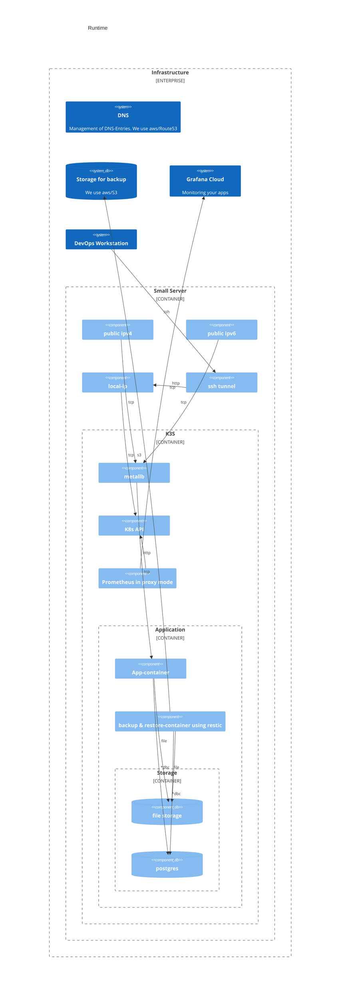

# Runtime View

```mermaid
C4Context
    title Runtime
    Enterprise_Boundary(b0, "Infrastructure") {
        System(dns, "DNS", "Management of DNS-Entries. We use aws/Route53")
        SystemDb(backup, "Storage for backup", "We use aws/S3") 
        System(grafana, "Grafana Cloud", "Monitoring your apps")
        System(devops, "DevOps Workstation")
        

        Container_Boundary(srv, "Small Server") {
            Container_Boundary(k3s, "K3S") {
                Component(lb, "metallb")
                Component(api, "K8s API")
                Component(prometheus, "Prometheus in proxy mode")
                Container_Boundary(app, "Application") {
                    Component(app, "App-container")
                    Component(app-backup, "backup & restore-container using restic")
                    Container_Boundary(app-storage, "Storage") {
                        ComponentDb(app-file-storage, "file storage")
                        ComponentDb(app-db-storage, "postgres")
                    }                    
                }
            }
            Component(ipv4, "public ipv4")
            Component(ipv6, "public ipv6")
            Component(localip, "local-ip")
            Component(ssh, "ssh tunnel")
        }
    }

    Rel(devops, ssh, "ssh")
    Rel(ssh, localip, "tcp")
    Rel(localip, api, "tcp")

    Rel(ipv4, lb, "tcp")
    Rel(ipv6, lb, "tcp")
    Rel(lb, app, "tcp")
    Rel(app, app-file-storage, "file")
    Rel(app, app-db-storage, "*dbc")

    Rel(prometheus, api, "http")
    Rel(prometheus, grafana, "http")

    Rel(app-backup, backup, "s3")
    Rel(app-backup, app-file-storage, "file")
    Rel(app-backup, app-db-storage, "*dbc")

```
