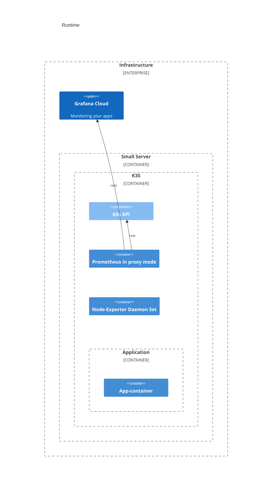

# Runtime View

```mermaid
C4Context
    title Runtime
    Enterprise_Boundary(b0, "Infrastructure") {
        System(grafana, "Grafana Cloud", "Monitoring your apps")
        
        Container_Boundary(srv, "Small Server") {
            Container_Boundary(k3s, "K3S") {
                Component(api, "K8s API")
                Container(prometheus, "Prometheus in proxy mode")
                Container(node-exporter, "Node-Exporter Daemon Set")
                Container_Boundary(app, "Application") {
                    Container(app, "App-container")
                }
            }
        }
    }

    Rel(prometheus, api, "rest")
    Rel(prometheus, grafana, "rest")
```