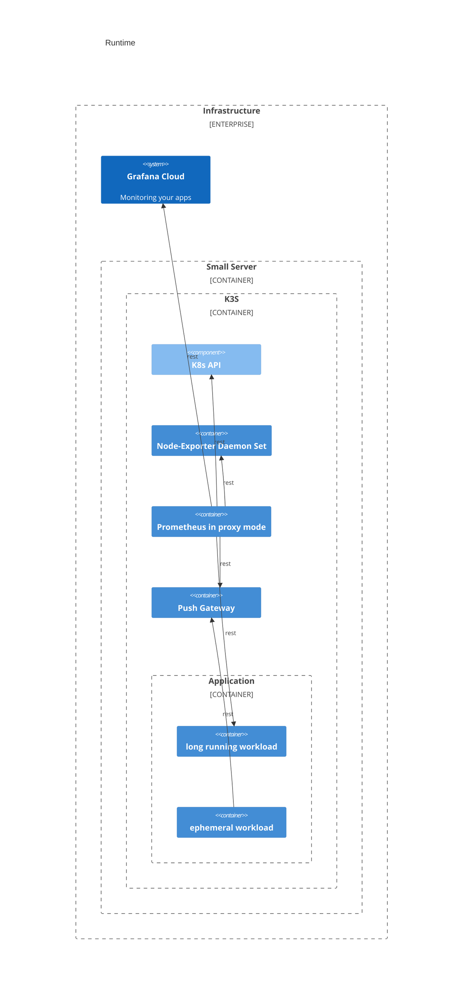

# Runtime View

```mermaid
C4Context
    title Runtime
    Enterprise_Boundary(b0, "Infrastructure") {
        System(grafana, "Grafana Cloud", "Monitoring your apps")
        
        Container_Boundary(srv, "Small Server") {
            Container_Boundary(k3s, "K3S") {
                Component(api, "K8s API")
                Container(ne, "Node-Exporter Daemon Set")
                Container(prom, "Prometheus in proxy mode")
                Container(pgw, "Push Gateway")
                Container_Boundary(app, "Application") {
                    Container(app, "long running workload")
                    Container(job, "ephemeral workload")
                }
            }
        }
    }

    Rel(prom, grafana, "rest")

    Rel(prom, api, "rest")
    Rel(prom, ne, "rest")
    Rel(prom, pgw, "rest")

    Rel(prom, app, "rest")
    Rel(job, pgw, "rest")
    

    UpdateLayoutConfig($c4ShapeInRow="2", $c4BoundaryInRow="1")
```